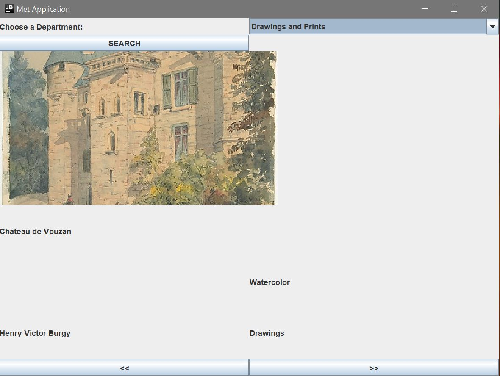

# Met API Display

This is a test application I wrote to demonstrate:

* APIs
* JSON
* Retrofit
* Gson
* Mockito
* Swing
* Model-View-Controller pattern
* Factory pattern
* Executable Jar

You can check out the API documentation information [here](https://metmuseum.github.io/#departments)

And find a downloadable jar file for this application [here](build/libs/Met_Exhibits-1.0-SNAPSHOT.jar)

### Functionality
A department can be chosen from the dropdown.
Specific pieces of art can then be viewed, as well as additional information about them.

